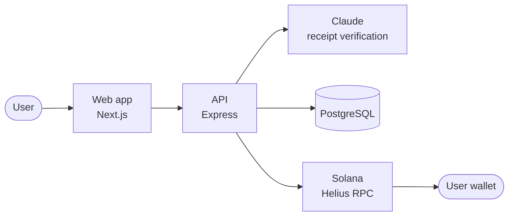

<div align="center">

<picture>
  <source media="(prefers-color-scheme: dark)" srcset="apps/web/public/brand/stackd-mark-light.svg">
  
</picture>

# Stackd

**Receipt cashback, paid in tokenized equity on Solana.**

[Live app](https://stackd-web-eosin.vercel.app) · [Brand kit](https://stackd-web-eosin.vercel.app/brand) · [Terms](https://stackd-web-eosin.vercel.app/terms) · [Privacy](https://stackd-web-eosin.vercel.app/privacy)

</div>

---

Stackd turns everyday purchases into ownership. Upload a receipt from a supported
brand, and a share of what you spent comes back as tokenized stock in that
company, sent directly to your Solana wallet.

Rewards are real equity exposure: Token-2022 assets issued by Backed Finance and
Backpack Securities, collateralised 1:1 by the underlying shares. Not points, and
not a token Stackd prints.

## How it works

1. **Upload a receipt.** A photo of a paper receipt, or a screenshot of an online order.
2. **Automatic verification.** A vision model reads the merchant, total and date,
   and the receipt is screened for tampering, duplication and eligibility. There
   is no manual review queue.
3. **Receive shares.** Tokenized stock transfers from the Stackd treasury to your
   wallet. Stackd never takes custody of user funds.

## Supported brands

| Brand | Token | Issuer | Cashback |
| --- | --- | --- | --- |
| McDonald's | `MCDx` | Backed Finance | 4% |
| Nike | `NKE` | Backpack Securities | 3% |
| lululemon | `LULU` | Backpack Securities | 3% |
| Netflix | `NFLXx` | Backed Finance | 3% |
| Amazon | `AMZNx` | Backed Finance | 2% |
| Costco | `COST` | Backpack Securities | 2% |
| Walmart | `WMTx` | Backed Finance | 2% |
| Apple | `AAPLx` | Backed Finance | 1% |

A brand is listed only when its token has live DEX liquidity, so every reward on
the list can be paid.

## Features

- **AI verification.** Claude extracts structured receipt data through a
  schema-enforced tool call, validated again on the server before any payout.
- **Layered fraud screening.** Image provenance, duplicate detection across all
  wallets, total reconciliation, date windows and rate limits.
- **Multi-currency.** Receipts in around 30 currencies, converted at European
  Central Bank reference rates.
- **Non-custodial.** Rewards go straight to the user's wallet. Phantom, Solflare
  and Backpack are supported.
- **Reliable payouts.** Idempotent transfers, confirmed on-chain, with a daily
  payout limit.
- **$STACKD bonus.** An optional bonus token launched on a Meteora Dynamic
  Bonding Curve.

## Architecture



| Path | Description |
| --- | --- |
| `apps/web` | Next.js 14 frontend (App Router) |
| `apps/api` | Express API for receipt verification and payouts |
| `apps/api/db` | PostgreSQL schema migrations |
| `packages/solana` | Shared Solana logic: brands, Token-2022, pricing, rewards, DBC |
| `scripts` | Token launch and operations tooling |

The repository is an npm workspace. `packages/solana` ships as TypeScript and is
compiled by Next.js through `transpilePackages`.

## Tech stack

| Layer | Technology |
| --- | --- |
| Frontend | Next.js 14, React 18, Tailwind CSS, Solana Wallet Adapter |
| Backend | Node.js, Express |
| AI | Claude, via the Anthropic API or OpenRouter |
| Blockchain | Solana, Token-2022, Meteora Dynamic Bonding Curve |
| Data | PostgreSQL (Supabase) |
| Pricing | Jupiter Price API, ECB reference rates |
| Hosting | Vercel (web), Railway (API) |

## Getting started

### Prerequisites

- Node.js 18.17 or later
- A [Helius](https://helius.dev) RPC key
- A PostgreSQL database
- An Anthropic API key, or an OpenRouter key

### Setup

```bash
npm install
cp .env.example apps/web/.env.local
cp .env.example apps/api/.env
```

Fill in the values described in `.env.example`, then apply the migrations in
`apps/api/db/migrations` in filename order.

### Run locally

```bash
npm run devnet:setup                  # devnet test tokens and a funded treasury
npm run dev                           # web app on http://localhost:3000
npm run dev --workspace=@stackd/api   # API on http://localhost:4000
```

Set `SOLANA_CLUSTER` to `devnet` or `mainnet`. On devnet, Stackd uses Token-2022
test tokens that mirror each xStock's decimals and scaled-amount multiplier, so
the full payout path runs without real assets.

### Test

```bash
npm test
```

## Technical notes

### Token-2022 and the Scaled UI Amount extension

Every supported xStock is a Token-2022 asset, so all account derivations and
transfers use the Token-2022 program. Backed Finance applies corporate actions
such as splits through a multiplier on the mint rather than by minting or
burning:

```
displayed balance = raw amount ÷ 10^decimals × multiplier
```

Stackd reads decimals and the active multiplier per mint, never per issuer, and
sends every payout through the inverse conversion, so the amount a user is shown
is the amount they receive. The logic lives in
[`packages/solana/src/scaled-amount.ts`](packages/solana/src/scaled-amount.ts).

### $STACKD

$STACKD is an optional bonus paid alongside the core reward, launched on a
Meteora Dynamic Bonding Curve.

| Allocation | Share |
| --- | --- |
| Bonding curve | 65% |
| DAMM v2 liquidity at graduation | 20% |
| Team, released after migration | 15% |

- Fixed supply of 1,000,000,000. Mint authority is immutable from genesis, so no
  further tokens can ever be minted.
- USDC quote, with a fixed 1% trading fee. The curve graduates to Meteora
  DAMM v2 at 750 USDC.
- The core reward never depends on $STACKD. If the bonus is unavailable, the
  share payout proceeds unchanged.

## Security

- Signing keys are held server-side and never reach the browser.
- Browser RPC traffic goes through a proxy restricted to read-only methods.
- The database lives in a private schema with row-level security; only the API
  can read or write it.
- Payouts are idempotent and bounded by a daily limit.

To report a vulnerability, please use GitHub's private vulnerability reporting on
this repository rather than opening a public issue.

## Disclaimer

Tokenized equities are issued by Backed Finance and Backpack Securities. Stackd is
not a broker-dealer and does not provide investment advice. Tokenized equities
carry risk, including loss of principal.

## License

[MIT](LICENSE)
